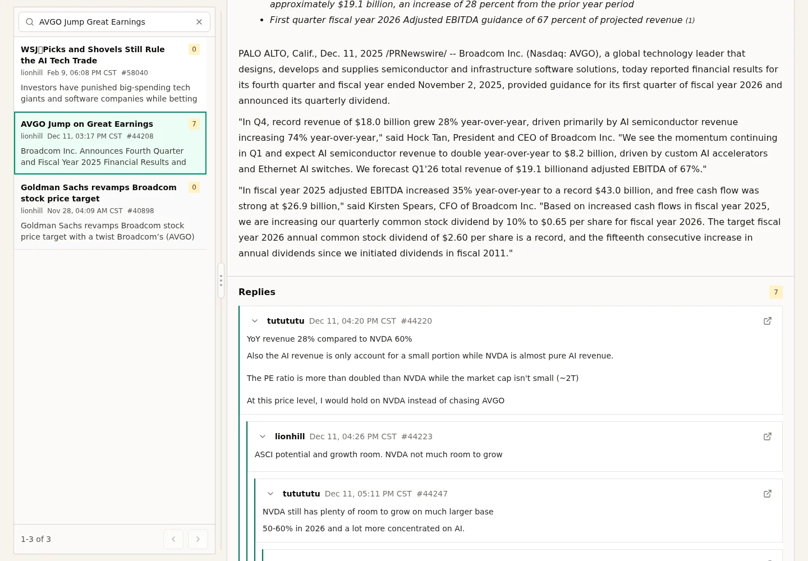

# wxc-cfzh

Local-first crawler and SQLite Inspector for the Wenxuecity `财富智汇` forum.
The crawler collects forum threads into a local SQLite database; the Inspector
turns that database into a searchable, read-only browser experience with
thread-aware reading, filtering, refresh, and export workflows.

## Quick Start

```bash
uv tool install rust-just
just setup-data
just inspect
```

`just setup-data` installs dependencies and downloads the latest published
SQLite snapshot into `data/crawler.sqlite3` when no local database exists.
`just inspect` builds and serves the Inspector at `http://127.0.0.1:8765`.

To build the database yourself instead of downloading a snapshot, run:

```bash
just setup
just crawl
just inspect
```

## What This Repo Does

- Crawls recent `财富智汇` listing and detail pages with Scrapy.
- Stores root posts, replies, nested reply relationships, authors, timestamps,
  source links, body HTML/text, read counts, byte counts, and crawl metadata in
  local SQLite.
- Tracks frontier state so interrupted or failed detail pages can be retried,
  while persistent upstream failures can be suppressed without hiding them.
- Boots new clones from a published SQLite snapshot when a fresh crawl is not
  needed.
- Exports records as flat JSONL or root posts with nested replies.
- Serves a FastAPI + React Inspector for searching, filtering, reading, local
  refresh, and post image export.
- Supports a small personal public deployment where browser traffic is
  read-only and production crawling is handled by CLI/scheduler operations.

## Inspector

The Inspector is the main way to read and explore the crawled database. It
shows database health, post/reply/author counts, latest crawl time, author
filters, date filters, result-type filters, full-text post/reply search, and
paginated results.


The reader keeps replies attached to their original root post, preserves nested
reply structure, and links back to the source forum. Reply search results open
the full thread and focus the matching reply in context. Inline images can be
previewed, and the selected root post can be copied or downloaded as a shareable
image with source metadata and a QR code.



In local-development mode, the Inspector Refresh control starts a real crawler
run against the same SQLite database being inspected. In public mode, browser
refresh only reloads read-only SQLite-backed API data; crawl writes are managed
outside the browser.

## Crawler

The crawler package owns Scrapy crawling, HTML parsing, SQLite persistence,
frontier state, retry/suppressed-failure accounting, and export shapes. Listing
pages are discovery feeds; stored records are organized by post and reply
identity.

```bash
just crawl
just crawl-smoke
just crawl pages=5 max_requests=25 log_level=INFO
just export-flat
just export-reddit
```

## Common Commands

```bash
just list
just doctor
just setup
just setup-data
just check
just data-download
just inspect
```

`just` is the root command harness for local workflows. Run `just setup` after
cloning or when `inspector/frontend/package.json` or `package-lock.json`
changes. Run `just list` for the complete command surface.

## Repository Map

- [AGENTS.md](AGENTS.md): short agent entry point and source-of-truth map.
- [justfile](justfile): canonical root command harness.
- [docs/index.md](docs/index.md): root documentation map.
- [docs/product-specs/index.md](docs/product-specs/index.md): product intent and workflows.
- [docs/operations.md](docs/operations.md): setup, crawl, export, inspect, and checks.
- [docs/deployment.md](docs/deployment.md): Docker, VPS operations, scheduler, and cost guardrails.
- [crawler/](crawler/): Scrapy crawler, SQLite persistence, exports, and tests.
- [crawler/docs/index.md](crawler/docs/index.md): crawler behavior, parameters, and data notes.
- [inspector/](inspector/): FastAPI backend and React frontend for SQLite inspection.
- [inspector/docs/index.md](inspector/docs/index.md): inspector startup, API, UI, and refresh notes.
- `data/`: ignored local SQLite databases, runtime files, snapshots, and exports.

This repo is doc-first. Start from the thin maps in [docs/](docs/index.md),
then open the source-of-truth doc for the task. Agent-specific planning,
exec-plan lifecycle, validation, and commit rules live in
[docs/design-docs/agent-workflow.md](docs/design-docs/agent-workflow.md).
